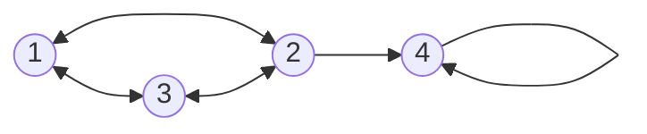

## 1. Introduction
**Q-Learning** is a foundational **Reinforcement Learning** algorithm. Unlike supervised or unsupervised learning, there is no dataset to study. Instead, an **Agent** interacts with an **Environment** to learn the optimal way to behave through trial and error.
* **The Goal:** To find the optimal **Policy** (a cheat sheet of what to do in every situation) that maximizes the total cumulative reward over time.
* **The Intuition:** Imagine placing a mouse in a maze. It wanders randomly. If it hits a wall, it gets a tiny shock (punishment). If it finds the cheese, it gets a massive reward. Q-Learning is the math the mouse uses to remember which paths lead to shocks and which lead to cheese, building a "quality" score (Q-value) for every possible move.

### The Core Components
* **State ($s$):** Where the agent is right now (e.g., Node 1).
* **Action ($a$):** What the agent chooses to do. 
* **Reward ($R$):** The immediate feedback for taking that action.

---

## 2. The Bellman Equation (Torn Apart)

This equation is the core engine of Q-Learning. It calculates the "Quality" ($Q$) of taking a specific action in a specific state.

$$
Q(s, a) = R(s, a) + \gamma \max_{a'=0}^{n} (Q(s', a'))
$$

**The Breakdown:**
* **$Q(s, a)$ / $Q[s][a]$ :** The new Q-value we are calculating for being in State $s$ and taking Action $a$.
* **$R(s, a)$:** The immediate reward for taking that action (pulled directly from our Reward Matrix).
* **$\gamma$ (Gamma):** The discount factor (between 0 and 1). It determines how much we care about *future* rewards versus *immediate* rewards.
* **$\max_{a'=0}^{n} (Q(s', a'))$:** The maximum Q-value we can get in the *next* state ($s'$). We look at all possible actions ($a'$) from the next state and pick the highest value available.

>[!important] Crucial Graph Clarification
> In a graph/node-based environment, an "Action" ($a$) literally *is* the next state ($s'$). If you are at Node 1, your action is "Go to Node 2". Therefore, your next state $s'$ is simply Node 2. Making this mental connection makes tracing the matrix calculations much easier.

---

## 3. Algorithm Mechanics (Pseudo-code)

**Inputs:**
* $R$-Matrix (Rewards)
* $\gamma$ (Discount factor)

**Algorithm:**
1. **INITIALIZE:** Create a $Q$-Matrix exactly the same size as the $R$-Matrix, but fill it entirely with zeros (the agent hasn't learned anything yet).
2. **LOOP (For each step/episode):**
   * Identify current state $s$.
   * Select a valid action $a$ (move to an adjacent node).
   * Observe the immediate reward $R(s, a)$ from the $R$-Matrix.
   * Look at the $Q$-Matrix row for the *next* state $s'$ (which equals $a$), and find its highest available value $\max_{a'=0}^{n} (Q(s', a'))$.
   * Calculate the new Q-value using the Bellman equation.
   * Update the $Q$-Matrix with this new value.
   * Set the current state to the new state ($s = s'$).
 ---
## 4. Environment Setup (Graph to Matrix)

Let's build a practical 4-Node environment to trace the math. 
* We start at **Node 1**. 
* The goal is to reach **Node 4**.

Here is the physical layout of our environment:

### The Reward Matrix ($R$)
Before the agent can learn anything, we must translate this physical graph into a mathematical Reward Matrix. The rows represent our **Current State**, and the columns represent the **Action** (which node we are attempting to move to).

**The Rules of our specific Environment:**
1. **Valid regular moves** yield a reward of `0` (neutral, no cheese yet).
2. **Invalid moves** (no edge exists) yield a penalty of `-1`. 
3. **The Goal move** yields a massive reward of `100`.
4. **The Goal State** connects to itself with a reward of `100` so the agent learns to stay there once it arrives.

| Current State \ Action | Move to 1 | Move to 2 | Move to 3 | Move to 4 |
| :---: | :---: | :---: | :---: | :---: |
| **Node 1** | -1 | 0 | 0 | -1 |
| **Node 2** | 0 | -1 | 0 | **100** |
| **Node 3** | 0 | 0 | -1 | -1 |
| **Node 4** | -1 | -1 | -1 | **100** |

---
## 5. The "Scenic Route" Execution (Tracing the Math)

Now we will trace a real episode of the agent learning. 

**The Setup:**
* **Start State:** Node 1
* **Goal State:** Node 4
* **$\gamma$ (Gamma):** 0.8 (Our agent is patient)

>[!warning] Exam Disclaimer
> In a high-pressure exam, if you are asked to trace an iteration, you generally want to take the absolute shortest path to the goal to minimize your calculations (e.g., 1 $\rightarrow$ 2 $\rightarrow$ 4). 
> However, for this revision guide, we are purposely taking a long, looping path. Why? Because taking the shortest path hides how the algorithm actually works. We need to take a "scenic route" so you can witness the magic of how the Q-values dynamically propagate backward.

**Initial Q-Matrix:** Because the agent hasn't explored anything yet, its brain is empty. Every possible move has a Quality score of zero.

| State \ Action | Move to 1 | Move to 2 | Move to 3 | Move to 4 |
| :---: | :---: | :---: | :---: | :---: |
| **Node 1** | 0 | 0 | 0 | 0 |
| **Node 2** | 0 | 0 | 0 | 0 |
| **Node 3** | 0 | 0 | 0 | 0 |
| **Node 4** | 0 | 0 | 0 | 0 |

---

### Trace Part 1: Wandering in the Dark
Let's force the agent to take the following path: **1 $\rightarrow$ 3 $\rightarrow$ 2 $\rightarrow$ 4**. 
*(Remember the Bellman Equation: $Q = R + \gamma \times \text{Max Future } Q$)*

**Step 1: Move from Node 1 to Node 3**
* **Current State:** 1 
* **Action taken:** Move to 3 *(meaning Next State = 3)*
* **Look at the R-Matrix:** The immediate treat for moving 1 $\rightarrow$ 3 is `0`.
* **Look at the Q-Matrix:** We peek at the Next State (Row 3). What is the highest value currently sitting in Row 3? It is `0`.
* **The Math:** $Q(1, 3) = 0 + 0.8(0) = \mathbf{0}$
* *(Result: The agent updates $Q(1,3)$ to 0. It learned nothing useful yet.)*

**Step 2: Move from Node 3 to Node 2**
* **Current State:** 3 
* **Action taken:** Move to 2 *(meaning Next State = 2)*
* **Look at the R-Matrix:** The immediate treat for moving 3 $\rightarrow$ 2 is `0`.
* **Look at the Q-Matrix:** We peek at the Next State (Row 2). What is the highest value currently sitting in Row 2? It is `0`.
* **The Math:** $Q(3, 2) = 0 + 0.8(0) = \mathbf{0}$
* *(Result: The agent updates $Q(3,2)$ to 0. Still wandering in the dark.)*

**Step 3: Move from Node 2 to Node 4 (The Jackpot!)**
* **Current State:** 2 
* **Action taken:** Move to 4 *(meaning Next State = 4)*
* **Look at the R-Matrix:** The immediate treat for moving 2 $\rightarrow$ 4 is **`100`**.
* **Look at the Q-Matrix:** We peek at the Next State (Row 4). The highest value in Row 4 is `0`.
* **The Math:** $Q(2, 4) = 100 + 0.8(0) = \mathbf{100}$
* *(Result: The agent found the cheese! It writes a massive 100 in its Q-Matrix.)*

---

### The Q-Matrix After Part 1
The agent has successfully reached the goal. Here is what its brain looks like now:

| State \ Action | Move to 1 | Move to 2 | Move to 3 | Move to 4 |
| :---: | :---: | :---: | :---: | :---: |
| **Node 1** | 0 | 0 | 0 | 0 |
| **Node 2** | 0 | 0 | 0 | **100** |
| **Node 3** | 0 | 0 | 0 | 0 |
| **Node 4** | 0 | 0 | 0 | 0 |

*(Notice how only the final move got a score? Node 3 and Node 1 still look completely useless, even though they were part of the winning path. Step 4 will fix this).*

---
### Trace Part 2: Iteration 2 (The Magic of Backward Propagation)

To see the real power of Q-Learning, we must run a second full episode. The agent resets to the starting node, but this time, it retains its memory (the Q-Matrix from Iteration 1, where $Q(2,4) = \mathbf{100}$).

**The Goal:** Reach Node 4. 
**The Path:** We will force the agent to take the exact same "scenic route" as before (**1 $\rightarrow$ 3 $\rightarrow$ 2 $\rightarrow$ 4**) to see how its updated brain changes the math.

**Step 1: Move from Node 1 to Node 3**
* **Current State:** 1 
* **Action taken:** Move to 3 *(meaning Next State = 3)*
* **Look at the R-Matrix:** The immediate treat for moving 1 $\rightarrow$ 3 is `0`.
* **Look at the Q-Matrix:** We peek at the Next State (Row 3). What is the highest value currently sitting in Row 3? It is still `0`.
* **The Math:** $Q(1, 3) = 0 + 0.8(0) = \mathbf{0}$
* *(Result: $Q(1,3)$ remains 0. The reward hasn't propagated this far back yet).*

**Step 2: Move from Node 3 to Node 2 (The Magic Trick)**
* **Current State:** 3 
* **Action taken:** Move to 2 *(meaning Next State = 2)*
* **Look at the R-Matrix:** The immediate treat for moving 3 $\rightarrow$ 2 is `0`.
* **Look at the Q-Matrix:** We peek at the Next State (Row 2). What is the highest value currently sitting in Row 2? **It is 100!** (Because the agent learned this in Iteration 1).
* **The Math:** $Q(3, 2) = 0 + 0.8(100) = \mathbf{80}$
* *(Result: The agent updates $Q(3,2)$ to 80. Node 3 now "knows" that Node 2 is a highly valuable stepping stone).*

**Step 3: Move from Node 2 to Node 4 (Hitting the Goal)**
* **Current State:** 2 
* **Action taken:** Move to 4 *(meaning Next State = 4)*
* **Look at the R-Matrix:** The immediate treat for moving 2 $\rightarrow$ 4 is `100`.
* **Look at the Q-Matrix:** We peek at the Next State (Row 4). The highest value in Row 4 is `0` (since Node 4 is the absorbing goal state, it never looks forward).
* **The Math:** $Q(2, 4) = 100 + 0.8(0) = \mathbf{100}$
* *(Result: $Q(2,4)$ remains 100. The episode successfully terminates).*

---

### The Final Updated Q-Matrix (End of Iteration 2)
After completing the second full iteration, the agent's brain looks like this:

| State \ Action | Move to 1 | Move to 2 | Move to 3 | Move to 4 |
| :---: | :---: | :---: | :---: | :---: |
| **Node 1** | 0 | 0 | 0 | 0 |
| **Node 2** | 0 | 0 | 0 | **100** |
| **Node 3** | 0 | **80** | 0 | 0 |
| **Node 4** | 0 | 0 | 0 | 0 |

>[!tip] The Final Takeaway (Why Q-Learning is Brilliant)
> Notice what just happened in Step 2 of Iteration 2. Even though moving from Node 3 to Node 2 gave absolutely no immediate reward ($R=0$), the `100` reward from the end of the maze bled backward through the matrix. 
> 
> If we ran a **3rd Iteration** along this exact same path, Step 1 ($1 \rightarrow 3$) would look at Row 3, see the new `80`, and calculate $Q(1,3) = 0 + 0.8(80) = \mathbf{64}$. 
> 
> Over time, the reward propagates backward step-by-step through the entire maze, leaving a perfect trail of numerical breadcrumbs for the agent to follow from any starting point!